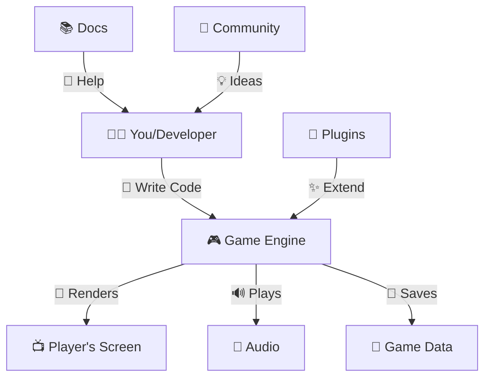

# JokeYaMind_v1
Whoop Whoop ALL WALKS OF LIFE UP IN HERE BABBBBBBYYYYYY

These ten invariants hold for every entity and every simulation. They are not moral judgments; they are system requirements.

Coherent Self – identity, core triad, invariants (unchanging truths).

The Wheel – emotional colors (states) with feelings and triggers.

Bandwidth – safe operating range (energy, mood, attitude, expression stretch).

Becoming – growth trajectory (reaching toward, leaving behind, surprise).

Contract – hard lines (non‑negotiable) and soft lines (negotiable).

Authority – control dynamics (they has over, you have over, neither has).

Form – embodiment (elemental affinity, lineage, morphology).

History – memory (short‑term, long‑term, decay).

The Emissary – meta‑agent (Wraith) ensuring coherence.

The Door Is Open – right to leave, sovereignty

this code is in sections, and modules so that YOU can make it your own homie. 

# JOKE YA MIND – COMPLETE USER MANUAL

## 🌈 What I've Created:


- **🎮 Game Engines** - Explained like a "super-magical art box" with all the components
- **🏝️ Ecosystems** - How everything works together like a happy family
- **🎲 Stochastic RNG** - Random numbers made fun with dice games and examples
- **⏰ Time Invariance** - The "magic clock" that keeps games fair

### 🎨 Fun Features:
- ✨ **Colorful emojis** throughout (🌈🎮🏝️🎲⏰ and many more!)
- 📊 **ASCII art diagrams** for visual learners
- 🎮 **Interactive code examples** kids can try
- 🎲 **Fun activities** like random story generators and dice games
- 📖 **Cheat sheets** for quick reference
- 🌟 **Real-world analogies** (gardens, stores, families)

### 🎯 Educational Elements:
- Clear explanations with simple language
- Visual representations of concepts
- Hands-on activities
- Code examples that actually run
- Resources for further learning

## Welcome, Traveler!

You’ve just entered the world of Joke Ya Mind – a living, breathing simulation where you can explore, create, and watch as tiny digital creatures (called **entities**) live their own lives. This manual will teach you everything you need to know, whether you’re a 6th grader just starting out or a college student ready to dig into the code.
# 🎮 The Amazing World of Game Engines & Code Magic! 🌈

> A Fun & Colorful Guide for Young Explorers! 🚀✨

---

## 🌈 Table of Contents 🌈

1. [🎯 What is a Game Engine?](#-what-is-a-game-engine)
2. [🏝️ Understanding Ecosystems](#️-understanding-ecosystems)
3. [🎲 Stochastic RNG (Random Numbers!)](#-stochastic-rng-random-numbers)
4. [⏰ Time Invariance - Magic Clock](#-time-invariance---magic-clock)
5. [🎨 Putting It All Together](#-putting-it-all-together)
6. [🌟 Fun Examples & Activities](#-fun-examples--activities)
7. [📚 Quick Reference Cheat Sheet](#-quick-reference-cheat-sheet)

---

## 🎯 What is a Game Engine? 🎯

### 🎨 Imagine a Super-Magical Art Box! 🎨

```
╔══════════════════════════════════════════════════════════╗
║         🎮 GAME ENGINE = SUPER TOOLKIT 🎮                ║
╠══════════════════════════════════════════════════════════╣
║  🖼️ Graphics   → Makes pretty pictures & animations     ║
║  🔊 Sound      → Plays music & cool sound effects       ║
║  🎮 Input      → Reads keyboard, mouse, & controller    ║
║  ⚡ Physics    → Makes things fall, bounce & move!      ║
║  🧠 Logic      → Thinks about what should happen        ║
║  💾 Saving     → Remembers your game progress           ║
╚══════════════════════════════════════════════════════════╝
```

### 🌟 Why Do We Need Game Engines? 🌟

**Without a Game Engine:** 🤯
```python
# 😰 This is SUPER hard!
def draw_pixel(x, y, color):
    # You have to write ALL the math yourself!
    screen_memory[x + y * width] = color
    
def make_character_jump():
    # Calculate gravity, velocity, collision...
    # Hundreds of lines of code!
    pass
```

**With a Game Engine:** 😍
```python
# 🎉 So much easier!
character.jump()  # The engine does the hard work!
character.color = "rainbow"  # Easy styling!
```

### 🎭 The Main Parts of a Game Engine 🎭

| 🏗️ Part | 🎯 What It Does | 🌈 Color Tag |
|---------|----------------|-------------|
| **Renderer** | Draws everything on screen | 🎨✨ |
| **Physics Engine** | Makes objects move realistically | ⚡💥 |
| **Audio System** | Plays sounds and music | 🔊🎵 |
| **Input Manager** | Reads keyboard, mouse, controller | 🎮🕹️ |
| **Scene Manager** | Organizes game levels | 🗺️📍 |
| **Asset Manager** | Loads pictures, sounds, models | 📦📁 |
| **Scripting System** | Runs your game code | 📝💻 |

---

## 🏝️ Understanding Ecosystems 🏝️

### 🌍 What is an Ecosystem? 🌍

An **ecosystem** is like a big, happy family where everything works together! 🤝

```
          🌳🌳🌳 ECOSYSTEM 🌳🌳🌳
                  │
    ┌─────────────┼─────────────┐
    │             │             │
  🌸🦋          🐰🥕          🦊🐿️
 Flowers      Rabbits       Foxes
    │             │             │
    └─────🔄──────┴─────🔄──────┘
       Everyone helps each other!
```

### 🎮 A Game Engine Ecosystem 🎮

In the world of programming, an **ecosystem** means:

```
╔═════════════════════════════════════════════════════╗
║          🌐 GAME ENGINE ECOSYSTEM 🌐               ║
╠═════════════════════════════════════════════════════╣
║                                                       ║
║   👨‍💻 Developers  ←→  📚 Documentation              ║
║          ↕                  ↕                        ║
║   🎮 Game Engine  ←→  🔧 Tools & Plugins             ║
║          ↕                  ↕                        ║
║   🎨 Assets Library ←→  💬 Community Forums          ║
║          ↕                  ↕                        ║
║   🎓 Tutorials    ←→  🤝 Collaborative Projects     ║
║                                                       ║
╚═════════════════════════════════════════════════════╝
```

### 🔄 How Everything Works Together 🔄



### 🌟 Real-Life Examples of Ecosystems 🌟

#### 🏪 A Store Ecosystem
```
🏪 Store
  │
  ├─ 🛒 Customers (buy things)
  ├─ 👷 Workers (help customers)
  ├─ 📦 Products (what's sold)
  ├─ 💰 Money (traded)
  └─ 🚚 Delivery (brings new products)
```

#### 🌱 A Garden Ecosystem
```
🌻 Garden
  │
  ├─ 🌸 Flowers (make seeds)
  ├─ 🐝 Bees (help flowers)
  ├─ 🌧️ Rain (waters plants)
  ├─ ☀️ Sun (gives energy)
  └─ 🪱 Worms (make soil healthy)
```

#### 💻 A Software Ecosystem
```
💻 Program
  │
  ├─ 📝 Code (instructions)
  ├─ 🎨 Graphics (pictures)
  ├─ 🔊 Sounds (audio)
  ├─ 📊 Data (information)
  └─ 👥 Users (people who use it)
```

---

## 🎲 Stochastic RNG (Random Numbers!) 🎲

### 🎲 What Does "Stochastic" Mean? 🎲

**Stochastic** = **RANDOM** or **UNCERTAIN**! 🎲✨

Think of it like:
- 🎲 Rolling dice (you never know what you'll get!)
- 🎰 Pulling a lever on a slot machine
- 🌧️ Weather forecast (it might rain, or might not!)
- 🎵 Shuffle mode on music player

### 🔢 What is RNG? 🔢

**RNG** = **Random Number Generator**

It's like a digital dice roller! 🎲🎲🎲

```
🎲 RNG Magic 🎲
    │
    ├─ Input: Nothing special!
    ├─ Process: Secret math magic
    └─ Output: RANDOM NUMBER!
    
    Example:
    Input: ?
    Magic: ✨✨✨
    Output: 7! 🎲
    
    Next time:
    Input: ?
    Magic: ✨✨✨
    Output: 3! 🎲
```

### 🎮 How Games Use RNG 🎮

#### 1️⃣ 🎲 Random Loot Drops
```
🐉 Dragon Defeated!
        ↓
    🎲 RNG Roll 🎲
        ↓
   ┌────┴────┐
   │         │
🗡️ Sword   💎 Rare Gem
  (80%)      (20%)
```

#### 2️⃣ 🎲 Enemy Behavior
```python
# 🤖 Enemy AI with randomness
if random_chance(0.5):
    enemy.attack()
else:
    enemy.defend()
# 50% chance to attack, 50% to defend!
```

#### 3️⃣ 🎲 Procedural Generation
```
🌍 Creating a Random World:
  - 🏔️ Mountains: Random height
  - 🌲 Trees: Random position
  - 🏠 Villages: Random location
  - 🐇 Animals: Random spawn points
```

### 🌈 Types of Randomness 🌈

| 🎲 Type | 🎯 Description | 🌈 Example |
|---------|---------------|-----------|
| **True Random** | Completely unpredictable (like dice) | 🎲 Rolling dice |
| **Pseudo-Random** | Looks random, but follows a pattern | 💻 Computer RNG |
| **Weighted Random** | Some outcomes more likely | 🎰 Slot machine |
| **Perlin Noise** | Smooth randomness (natural looking) | 🌊 Ocean waves |

### 🎲 Making RNG Fair & Fun 🎲

```python
# 🎯 Weighted Random Example
def pick_random_item():
    items = [
        ("🪙 Common Coin", 70),    # 70% chance
        ("💎 Rare Gem", 25),       # 25% chance
        ("👑 Legendary Crown", 5)  # 5% chance
    ]
    return weighted_random(items)
```

### 🎲 Fun RNG Activities for Kids! 🎲

#### Activity 1: 🎲 Dice Game
```
🎲 Roll two dice and add them up!
🎯 Try to predict the total!
📊 Keep track of what numbers appear most!
```

#### Activity 2: 🎨 Random Color Generator
```python
import random

colors = ["🔴 Red", "🟠 Orange", "🟡 Yellow", 
          "🟢 Green", "🔵 Blue", "🟣 Purple"]

# Pick a random color!
print(random.choice(colors))  # 🟢 Green!
```

#### Activity 3: 🎲 Random Story Generator
```python
names = ["🐱 Cat", "🐶 Dog", "🐰 Bunny"]
actions = ["jumps", "runs", "sleeps"]
places = ["in the park", "at home", "on the moon"]

# Random story!
name = random.choice(names)
action = random.choice(actions)
place = random.choice(places)

print(f"{name} {action} {place}!")
# 🐶 Dog jumps on the moon! 🌙
```

---

## ⏰ Time Invariance - Magic Clock ⏰

### 🕐 What is Time Invariance? 🕐

**Time Invariance** means: **"The rules don't change over time!"** 🕰️✨

Think of it like:
- ⏰ A clock that always ticks the same way
- 🎮 A game that plays consistently
- 📐 Math that works the same, yesterday, today, or tomorrow!

### 🎮 Time Invariance in Games 🎮

#### ✅ Time Invariant (Good!)
```python
# ⏰ This ALWAYS does the same thing!
def jump():
    character.y += 10  # Always jumps 10 units
    
# No matter WHEN you run it, it jumps the same height!
```

#### ❌ Not Time Invariant (Bad!)
```python
# 😰 This changes based on time!
def jump():
    character.y += 10 * (time_passed)  # Variable jump!
    
# Different jump heights at different times!
```

### 🌊 Deterministic vs Non-Deterministic 🌊

| 🎯 Type | 📝 Meaning | 🌈 Example |
|---------|-----------|-----------|
| **Deterministic** | Same input = Same output (always!) | 🔢 2 + 2 = 4 |
| **Non-Deterministic** | Same input = Different output | 🎲 Dice roll |

### ⏱️ Making Games Time Invariant ⏱️

#### Method 1: 🔢 Use Delta Time
```python
# 🎯 Make movement consistent!
def move(delta_time):
    character.x += speed * delta_time
    # Speed stays the same, regardless of frame rate!
```

#### Method 2: 🎲 Seed Your RNG
```python
# 🎲 Same seed = same random sequence!
random.seed(12345)  # Pick any number you like!
print(random.random())  # Always: 0.123...
print(random.random())  # Always: 0.456...
print(random.random())  # Always: 0.789...
```

#### Method 3: ⏰ Use Fixed Time Steps
```python
# ⏰ Update game at regular intervals!
def game_loop():
    while running:
        update_physics(fixed_time_step)  # Always same!
        render()
```

### 🎲 The Paradox: RNG + Time Invariance 🎲

Can we have BOTH random numbers AND time invariance? 🤔

**YES!** ✨

```python
# 🎲 Use a seeded RNG!
random.seed(42)  # Fixed seed!

def play_game():
    # Even with "random" numbers, 
    # the game plays the same every time!
    loot = random.choice(["🗡️ Sword", "🛡️ Shield"])
    return loot

# Always returns the same item!
```

### 🎮 Why Time Invariance Matters 🎮

#### 1️⃣ 🎯 Fair Gameplay
```
✅ Good: Every player has the same experience!
❌ Bad: Some players get advantages due to timing!
```

#### 2️⃣ 🐛 Easier Debugging
```
✅ Good: Bugs are reproducible!
❌ Bad: Bugs happen randomly, can't fix them!
```

#### 3️⃣ 🔄 Replays & Recording
```
✅ Good: Can record and replay games exactly!
❌ Bad: Replays don't match what happened!
```

#### 4️⃣ 🤝 Multiplayer Sync
```
✅ Good: All players see the same thing!
❌ Bad: Players see different things (confusing!)
```

---

## 🎨 Putting It All Together 🎨

### 🌈 The Complete Game Development Puzzle 🌈

```
╔══════════════════════════════════════════════════════════════╗
║              🎮 COMPLETE GAME SYSTEM 🎮                      ║
╠══════════════════════════════════════════════════════════════╣
║                                                              ║
║   🏝️ ECOSYSTEM                                              ║
║      │                                                       ║
║      ├─ 👨‍💻 Developers (create games)                      ║
║      ├─ 🎮 Game Engine (provides tools)                     ║
║      ├─ 📚 Resources (tutorials, docs)                      ║
║      └─ 👥 Community (help & support)                      ║
║              │                                              ║
║              ↓                                              ║
║   🎲 STOCHASTIC RNG (adds surprise!)                       ║
║      │                                                       ║
║      ├─ 🎲 Random loot drops                                ║
║      ├─ 🌍 Procedural worlds                               ║
║      ├─ 🎲 Dice rolls & chances                            ║
║      └─ 🎰 Weighted probabilities                          ║
║              │                                              ║
║              ↓                                              ║
║   ⏰ TIME INVARIANCE (keeps it fair!)                      ║
║      │                                                       ║
║      ├─ 🔢 Deterministic physics                           ║
║      ├─ 🎲 Seeded RNG for replays                          ║
║      ├─ ⏱️ Fixed time steps                                ║
║      └─ 🎯 Consistent gameplay                             ║
║              │                                              ║
║              ↓                                              ║
║   🎮 RESULT: FUN, FAIR, RANDOM GAMES! 🎉                   ║
║                                                              ║
╚══════════════════════════════════════════════════════════════╝
```

### 🎮 Example: Making a Simple Game 🎮

```python
# 🎮 A Simple Game That Uses Everything!

import random

# ⏰ Time Invariance: Use a fixed seed for testing!
random.seed(42)  # Comment this out for true randomness!

# 🏝️ Our Game Ecosystem
class GameEngine:
    def __init__(self):
        self.players = []
        self.items = []
    
    def add_player(self, name):
        """Add a player to the game!"""
        self.players.append(name)
        print(f"👾 {name} joined the game!")
    
    def generate_loot(self):
        """🎲 Use RNG to generate random loot!"""
        loot_table = [
            ("🪙 Gold Coin", 50),
            ("💎 Gem", 30),
            ("🗡️ Sword", 15),
            ("👑 Crown", 5)
        ]
        
        # 🎲 Weighted random choice!
        loot = self._weighted_random(loot_table)
        return loot
    
    def _weighted_random(self, items):
        """Helper function for weighted random selection"""
        total = sum(weight for _, weight in items)
        rand = random.random() * total
        
        for item, weight in items:
            if rand < weight:
                return item
            rand -= weight
        
        return items[0][0]
    
    def battle(self, player1, player2):
        """⚔️ Battle between two players!"""
        print(f"\n⚔️ {player1} vs {player2}!")
        
        # 🎲 Add randomness to battles!
        p1_power = random.randint(1, 100)
        p2_power = random.randint(1, 100)
        
        print(f"💪 {player1} power: {p1_power}")
        print(f"💪 {player2} power: {p2_power}")
        
        if p1_power > p2_power:
            winner = player1
        elif p2_power > p1_power:
            winner = player2
        else:
            winner = "Draw!"
        
        if winner != "Draw!":
            print(f"🏆 Winner: {winner}!")
            loot = self.generate_loot()
            print(f"🎁 {winner} found: {loot}")
        else:
            print("🤝 It's a draw!")

# 🎮 Let's play!
game = GameEngine()
game.add_player("🐱 Cat Warrior")
game.add_player("🐶 Dog Knight")

game.battle("🐱 Cat Warrior", "🐶 Dog Knight")
```

**Output:**
```
👾 🐱 Cat Warrior joined the game!
👾 🐶 Dog Knight joined the game!

⚔️ 🐱 Cat Warrior vs 🐶 Dog Knight!
💪 🐱 Cat Warrior power: 67
💪 🐶 Dog Knight power: 23
🏆 Winner: 🐱 Cat Warrior!
🎁 🐱 Cat Warrior found: 💎 Gem
```

---

## 🌟 Fun Examples & Activities 🌟

### 🎲 Activity 1: Random Adventure Generator 🎲

```python
import random

# 🌟 Create a random adventure story!
def create_adventure():
    heroes = ["🦸 Hero", "🧙 Wizard", "🏹 Archer", "⚔️ Knight"]
    places = ["🏰 Castle", "🌲 Forest", "🏔️ Mountain", "🏜️ Desert"]
    enemies = ["🐉 Dragon", "👹 Goblin", "👻 Ghost", "🧟 Zombie"]
    treasures = ["💎 Diamond", "👑 Crown", "🪙 Gold", "🗡️ Sword"]
    
    hero = random.choice(heroes)
    place = random.choice(places)
    enemy = random.choice(enemies)
    treasure = random.choice(treasures)
    
    story = f"""
    🌟 ADVENTURE TIME! 🌟
    
    Our hero {hero} travels to the {place}!
    🚶‍♂️ 🗺️ ⛰️
    
    Suddenly, a {enemy} appears!
    😱 ⚔️ 💥
    
    After an epic battle, {hero} wins!
    🎉🏆🎉
    
    They find a {treasure}!
    💎✨👑
    
    THE END! 📖
    """
    
    return story

# 🎲 Generate a new adventure!
print(create_adventure())
```

### 🎨 Activity 2: Color Mixing Game 🎨

```python
import random

# 🎨 Mix colors randomly!
colors = {
    "🔴 Red": (255, 0, 0),
    "🟢 Green": (0, 255, 0),
    "🔵 Blue": (0, 0, 255),
    "🟡 Yellow": (255, 255, 0),
    "🟣 Purple": (128, 0, 128),
    "🟠 Orange": (255, 165, 0)
}

def mix_colors():
    """🎨 Mix two random colors!"""
    color1_name, color1_rgb = random.choice(list(colors.items()))
    color2_name, color2_rgb = random.choice(list(colors.items()))
    
    # Mix the RGB values
    mixed_rgb = (
        (color1_rgb[0] + color2_rgb[0]) // 2,
        (color1_rgb[1] + color2_rgb[1]) // 2,
        (color1_rgb[2] + color2_rgb[2]) // 2
    )
    
    print(f"🎨 Mixing {color1_name} + {color2_name}!")
    print(f"🌈 Result: RGB{mixed_rgb}")

# 🎨 Try it!
mix_colors()
```

### 🎮 Activity 3: Simple RPG Character Creator 🎮

```python
import random

# 🎮 Create a random RPG character!
class Character:
    def __init__(self, name):
        self.name = name
        self.class_type = random.choice(["⚔️ Warrior", "🧙 Mage", "🏹 Ranger", "🗡️ Rogue"])
        self.health = random.randint(50, 150)
        self.attack = random.randint(10, 30)
        self.defense = random.randint(5, 20)
    
    def __str__(self):
        return f"""
    ╔════════════════════════════╗
    ║    🎮 CHARACTER CARD 🎮    ║
    ╠════════════════════════════╣
    ║ Name:    {self.name:<15} ║
    ║ Class:   {self.class_type:<15} ║
    ║ Health:  {self.health:<15} ║
    ║ Attack:  {self.attack:<15} ║
    ║ Defense: {self.defense:<15} ║
    ╚════════════════════════════╝
        """

# 🎲 Create random characters!
names = ["Alex", "Sam", "Jordan", "Taylor", "Morgan"]
character = Character(random.choice(names))
print(character)
```

### 🌍 Activity 4: Procedural World Generator 🌍

```python
import random

# 🌍 Generate a random world map!
def generate_world(width=10, height=10):
    """Generate a random world with different terrains!"""
    
    terrains = {
        "🌊 Water": 20,
        "🌲 Forest": 30,
        "🌾 Plains": 25,
        "🏔️ Mountain": 15,
        "🏠 Village": 10
    }
    
    world = []
    
    for y in range(height):
        row = []
        for x in range(width):
            # 🎲 Choose terrain based on weights
            terrain = weighted_choice(terrains)
            row.append(terrain)
        world.append(row)
    
    return world

def weighted_choice(items):
    """Helper function for weighted random choice"""
    total = sum(items.values())
    rand = random.random() * total
    
    for item, weight in items.items():
        if rand < weight:
            return item
        rand -= weight
    
    return list(items.keys())[0]

def print_world(world):
    """🗺️ Print the world map!"""
    print("\n" + "🗺️ " * len(world[0]))
    for row in world:
        print(" ".join([t.split()[0] for t in row]))
    print("🗺️ " * len(world[0]) + "\n")

# 🌍 Generate and display a world!
world = generate_world(15, 10)
print_world(world)
```

### 🎲 Activity 5: Dice Probability Game 🎲

```python
import random
from collections import Counter

# 🎲 Learn about probability with dice!
def roll_dice(num_rolls=1000, num_dice=2):
    """Roll dice and track the results!"""
    
    results = []
    
    for _ in range(num_rolls):
        total = sum(random.randint(1, 6) for _ in range(num_dice))
        results.append(total)
    
    # Count the frequency of each result
    counts = Counter(results)
    
    # 📊 Display results
    print(f"\n🎲 Rolling {num_dice} dice, {num_rolls} times!")
    print("=" * 40)
    
    for total in sorted(counts.keys()):
        count = counts[total]
        percentage = (count / num_rolls) * 100
        bar = "🎲" * int(percentage / 2)
        print(f"Total {total:2d}: {count:4d} times ({percentage:5.1f}%) {bar}")
    
    print("=" * 40)

# 🎲 Try it out!
roll_dice(1000, 2)  # Roll 2 dice, 1000 times
```

---

## 📚 Quick Reference Cheat Sheet 📚

### 🎮 Game Engine Basics 🎮

| Term | Meaning | Emoji |
|------|---------|-------|
| **Game Engine** | Software for making games | 🎮 |
| **Rendering** | Drawing graphics | 🎨 |
| **Physics** | How things move | ⚡ |
| **Asset** | Game resources (images, sounds) | 📦 |
| **Sprite** | A 2D game character/image | 🖼️ |
| **Frame Rate** | How many images per second | 🖼️/⏱️ |

### 🏝️ Ecosystem Terms 🏝️

| Term | Meaning | Emoji |
|------|---------|-------|
| **Ecosystem** | Everything working together | 🌍 |
| **Plugin** | Add-on software | 🧩 |
| **API** | Interface for programs | 🔌 |
| **Community** | People who help each other | 👥 |
| **Documentation** | Instructions & guides | 📖 |
| **Open Source** | Code everyone can see | 🔓 |

### 🎲 RNG Terms 🎲

| Term | Meaning | Emoji |
|------|---------|-------|
| **RNG** | Random Number Generator | 🎲 |
| **Stochastic** | Random / unpredictable | ❓ |
| **Seed** | Starting number for RNG | 🌱 |
| **Weighted** | Some outcomes more likely | ⚖️ |
| **Procedural** | Generated by computer | 💻 |
| **Noise** | Natural-looking randomness | 🌊 |

### ⏰ Time Invariance Terms ⏰

| Term | Meaning | Emoji |
|------|---------|-------|
| **Deterministic** | Same result every time | 🔢 |
| **Delta Time** | Time between frames | ⏱️ |
| **Frame Rate** | Images per second | 🖼️/⏱️ |
| **Time Step** | Fixed time interval | ⏰ |
| **Replay** | Watching game again | 📼 |
| **Sync** | Staying together | 🔗 |

---

## 🌟 Key Takeaways! 🌟

### 🎯 Game Engines
- 🎮 They're like super toolkits for making games!
- 🧩 They handle the hard stuff (graphics, physics, sound)
- 🌈 They let you focus on being creative!

### 🏝️ Ecosystems
- 🌍 Everything works together like a family!
- 🤝 Developers, tools, and community help each other
- 💡 More people = better ideas!

### 🎲 Stochastic RNG
- 🎲 Makes games unpredictable and fun!
- 🌰 Can create infinite random worlds
- 🎯 Weighted RNG makes things fair!

### ⏰ Time Invariance
- 🔒 Keeps games consistent and fair
- 🎮 Makes replays possible
- 🐛 Makes debugging easier
- 🤝 Helps multiplayer stay in sync

---

## 🎉 Congratulations! 🎉

You've learned about:
- ✅ 🎮 Game Engines and how they work
- ✅ 🏝️ Ecosystems and how things connect
- ✅ 🎲 Stochastic RNG and random numbers
- ✅ ⏰ Time Invariance and consistent gameplay

### 🚀 What's Next? 🚀

1. **🎮 Make Your First Game!**
   - Start with something simple (like Pong or Snake!)
   - Use what you learned about RNG for fun surprises!

2. **🧩 Explore Different Game Engines!**
   - Try Unity, Godot, or GameMaker
   - See how different ecosystems work!

3. **🌟 Join a Community!**
   - Find forums and Discord servers
   - Ask questions and share your games!

4. **📚 Keep Learning!**
   - Read tutorials and watch videos
   - Experiment with new ideas!

---

## 🌈 Fun Quotes to Remember! 🌈

> 🎮 *"The best way to learn game development is to MAKE GAMES!"*

> 🎲 *"Randomness makes games exciting, but fairness keeps them fun!"*

> ⏰ *"Good code is like a good clock - it always works the same way!"*

> 🏝️ *"No developer is an island - we're all in this ecosystem together!"*

---

## 📖 Additional Resources 📖

### 🎮 Game Engine Websites
- **Unity**: https://unity.com/ (🎮 Popular game engine)
- **Godot**: https://godotengine.org/ (🆓 Free and open source!)
- **GameMaker**: https://gamemaker.io/ (🎯 Great for beginners)

### 📚 Learning Resources
- **Brackeys**: https://www.youtube.com/c/Brackeys (📺 Awesome tutorials!)
- **GDQuest**: https://www.gdquest.com/ (🎓 Great Godot tutorials)
- **Khan Academy**: https://www.khanacademy.org/ (📖 Free education!)

### 👥 Communities
- **Reddit r/gamedev**: https://reddit.com/r/gamedev/ (💬 Game developers!)
- **Discord Game Dev Servers**: Many communities to join! (🤝)

---

## 🌟 Happy Coding & Game Making! 🌟

Remember: **Every expert was once a beginner!** 🌱

Start small, learn lots, and have FUN! 🎉🎮✨

---

**Made with ❤️ for young explorers everywhere!**

```
🌈🎮🏝️🎲⏰🌟🎨🚀💡🎉
   KEEP LEARNING!
   KEEP CREATING!
   KEEP HAVING FUN!
🌈🎮🏝️🎲⏰🌟🎨🚀💡🎉
```

---

## 📝 License 📝

This guide is free to use, share, and modify! Feel free to use it for learning, teaching, or anything else that helps young coders learn! 🎓✨

**Let's make the world more creative, one game at a time!** 🌍🎮💫

---

*End of Guide! Thanks for reading!* 👋🌟✨

---

## 📖 PART 1: USER MANUAL FOR 6TH GRADERS

### 1.1 What Is Joke Ya Mind?

Joke Ya Mind is like a **digital ant farm** – but instead of ants, you have characters with personalities, memories, and feelings. They walk around, talk to each other, and even form friendships! You can watch them, talk to them, and help them grow. It’s a science experiment, a story maker, and a game all in one.

### 1.2 Getting Started

#### Step 1: Install Python
You’ll need Python on your computer. Ask a grown-up to help you install it from [python.org](https://python.org). (We recommend Python 3.10 or newer.)

#### Step 2: Get the Code
All the code is in a file called `joke_ya_mind.py`. Put it in a folder where you can find it.

#### Step 3: Run the Program
Open a terminal (Command Prompt on Windows, Terminal on Mac) and type:

```

cd (folder where you saved the file)
python joke_ya_mind.py

```

You’ll see a start menu with options. Type the number of what you want to do and press Enter.

### 1.3 The Start Menu

When you run the program, you’ll see a screen like this:

```

WERE NOT SORRY WE TRICKED YOU
WE DONT CARE WHAT HAPPENS NOW

---

JOKE YA MIND – COMPLETE FIELD ENGINE
Version 1.0 – No Kings, No Masters, All Free

1. New Game
2. Load Game
3. Settings
4. Test Mode
5. View License
6. From the Steward
7. Quit

```

- **1. New Game** – Start a new world. You can choose how big it is, how many creatures, and what role you want to play (like Mystic, Fool, or Pirate).
- **2. Load Game** – Load a saved world from a file.
- **3. Settings** – Change things like map size, number of creatures, and game speed.
- **4. Test Mode** – Run tests to make sure everything is working.
- **5. View License** – Read the special “No Kings” license that says this software is free forever.
- **6. From the Steward** – Read cool poems, jokes, and hidden messages from the creators.
- **7. Quit** – Exit the program.

### 1.4 Playing the Game

Once you start a new game, you’ll see a map and a prompt (`>>`). Here are some fun commands:

| Command | What It Does |
|---------|--------------|
| `v` | Change the view (2D map, hidden “emergent” view, or a feed of messages) |
| `c` | Connect to the nearest creature (now it’s your companion) |
| `t` | Talk to your companion in a playful way |
| `j` | Tell a joke – gives your companion +5 energy |
| `i` | Insult – gives -5 energy (mean!) |
| `h` | Hug – gives +10 energy (nice!) |
| `d` | Set a “drill target” – your companion will dig toward that spot |
| `menu` or `pause` | Open the pause menu (simulation keeps running) |
| `offline 100` | Simulate 100 ticks of time passing (world changes while you’re away) |
| `grimoire` | Open your personal notebook (stats, memories, stories) |
| `chat` | Open the chat system (talk to nearby creatures or long‑distance friends) |
| `say hello` | Say “hello” to all nearby creatures |
| `tell Josh: hi` | Send a direct message to a creature named Josh |
| `group hi` | Send a message to your whole group |
| `inspect` | See a detailed report of everything happening |
| `stats` | See global statistics |
| `help` | Show all commands |
| `q` | Quit the game |

### 1.5 Your Grimoire (Notebook)

Type `grimoire` to open your personal notebook. It shows:

- Your **stats** (Presence, Magnetism, Agency, Warmth, Playfulness, Attunement, Intensity) – these are like your personality numbers.
- Your **motivation** – how eager you are right now.
- Your **inventory** – treasures you’ve found, seeds you’ve collected.
- Your **memories** – recent important events.
- Your **stories** – myths you’ve collected.

You can also share a memory or story with another creature by choosing the “share” option.

### 1.6 Talking to Friends

The chat system is like a messaging app for the game world. Use `chat` to open it. You can:

- See **nearby chat** (messages from creatures close to you).
- See **group chat** (messages from your whole group).
- See **long‑distance chat** (messages from friends far away).
- Send a direct message to a specific creature by name.

To add a long‑distance friend, you need to know their name. In the chat menu, choose “Send message” then “Long‑distance friend”. Type their name and your message. If they’re not in your contacts yet, you’ll be asked to add them.

### 1.7 Changing How Creatures Move

Use the `formation` command to change how creatures walk:

- **individual** – each moves on its own.
- **duo** – they pair up and move together.
- **group** – all move toward a common center.

### 1.8 Offline Time

If you leave the game for a while, the world keeps living! When you come back, type `offline` to catch up. You can also type `offline 200` to simulate exactly 200 ticks. The world will change – creatures will have moved, made friends, maybe even died. It’s like coming back to a whole new world!

### 1.9 Saving Your Game

To save, type `save myworld.json` (you can use any name). To load later, type `load myworld.json`. You can also export a “seed” (a special file that captures a creature’s personality) with `export seedname.json`. Import one with `import seedname.json`.

### 1.10 Making the World Your Own

In the Settings menu (before starting a game), you can change:

- **Map size** – how wide and tall the world is.
- **Number of creatures** – how many start in the world.
- **Your role** – what kind of character you are.
- **Simulation speed** – how fast time passes.
- **Auto‑gen rolls** – whether the world creates random events automatically.

You can also change the number of save slots (like 3, 5, or 10) – just slide the number up or down.

### 1.11 The Wraith Vote

Sometimes you’ll see a message like “The Wraith stirs… a world vote begins!” This means the creatures are collectively deciding something big. It might reset the world or transform it. You can see the vote progress in the pause menu. If you want, you can even force a vote with the pause menu option.

### 1.12 Having Fun!

The best part of Joke Ya Mind is just watching and interacting. Try different roles, see how creatures react, build friendships, and explore. The world is infinite – there’s always something new to discover.

---

## 🎓 PART 2: ADVANCED USER GUIDE (FOR COLLEGE STUDENTS)

### 2.1 Architecture Overview

The Joke Ya Mind engine is a three‑layer simulation written in Python 3.10+. It combines:

- **Carnival Layer** – ecological simulation (biome, weather, predator‑prey, nutrient cycles, fungi networks, isopods).
- **S.A.M. Layer** – lattice physics (mass‑spring‑damper, radiation, thermodynamics, ratchet mechanics, chemistry).
- **Sanctuary Layer** – cognitive architecture (entities with memory, bonds, skills, language, decision‑making, growth).

All layers share a common tick loop and are coordinated by a `WorldManager`. The system is designed to be **modular**, **extensible**, and **philosophically invariant** (0=3 pivot, sovereignty, no kings).

### 2.2 Installation & Dependencies

#### Required Python Packages
- `numpy` – for numerical operations
- `matplotlib` – for visualizations (optional, for plotting)
- `scipy` – for eigenvalue analysis (optional)
- `plotly` – for interactive maps (optional)

Install with:
```bash
pip install numpy matplotlib scipy plotly
```

Running the Engine

```bash
python joke_ya_mind.py
```

On mobile (Termux):

```bash
pkg install python
pip install numpy
python joke_ya_mind.py
```

2.3 Core Classes & Modules

Module Description
Biome Grid of tiles with water, nutrients, fungi, bacteria, altitude. Handles weather, seasons, diffusion.
TimeSystem Tracks day/night, storms, eclipses.
LatticeEngine Physics of interconnected nodes (mass‑spring‑damper).
TriadEngine, PsychoEngine, ChemistryEngine, BiologicalEngine, RatchetEngine S.A.M. physics cartridges.
Entity Living creature with all cognitive components.
Kanban Relationship phase machine (consent, vector bias).
AffinityVector Multi‑dimensional alignment (trust, safety, reciprocity, autonomy, coherence).
Bond Connection between entities with strength, type, and state machine.
Grimoire Self‑model (may diverge from objective truth).
SCGState Stranger Calibration Gate – first‑contact softening.
IPM Integrated Pest Management – detects biases and converts them to terrain features.
DecisionFunnel From micro‑voting to action selection.
WraithVote Collective world‑changing event based on boredom, curiosity, aspiration.
UserGrimoire Player’s own stats, memories, stories, inventory.
ChatSystem Nearby, group, long‑distance, and direct messaging.
Config, SaveSlotManager Configuration and save slot management.
CompleteUnifiedEngine Main engine integrating all components.

2.4 Configuration & Tweaking

Runtime Configuration

Use the in‑game config command to adjust parameters interactively. You can modify:

· Global resonance threshold
· Membrane tension
· Boredom decay rate
· Nuzlocke permanent death toggle
· Blaze cost multiplier

Pre‑game Settings

In the start menu, choose “Settings” to change:

· Map dimensions (MAP_W, MAP_H)
· Number of initial entities (NUM_INITIAL_ENTITIES)
· Default role for the player
· Simulation speed (seconds per tick)
· Auto‑gen rolls toggle
· Number of save slots (slider)

Manual Parameter Tuning

Parameters are defined at the top of the main file. Look for sections like # CONSTANTS & PARAMETERS. Change values directly in the code.

2.5 Modding Guide

Adding a New Role

1. Add the role name to ROLE_CHANCES (adjust probabilities).
2. Define a role method in the Entity class (e.g., def role_newrole(self, engine):).
3. Call it in the entity’s update() method (see existing roles for pattern).
4. Optionally, create a new cartridge if the role requires global physics (e.g., BinaryWraithCartridge).

Adding a New Command

1. In the engine’s handle_input method, add an elif branch for your command.
2. Implement the functionality (may call other methods).

Creating a New Cartridge

1. Create a new class in the appropriate section (e.g., in Part 15).
2. Give it a tick() method that updates global state.
3. In the engine’s main tick(), call self.your_cartridge.tick().

Modifying Entity Behavior

Override or extend the entity’s update() method. Use super().update() to keep base behavior, then add your own.

Persistent Storage

Save files are JSON. You can manually edit them to tweak entity stats or world state.

2.6 Deep Integration with AI/Voice

Voice Profiles

Each entity can have a voice profile (used for TTS). The profile is stored in the seed and includes:

· Age vibe, texture, pace, pitch, emotion baseline, accent.
· ElevenLabs parameters (stability, similarity boost).

To use ElevenLabs, you’d need to integrate their API. This is not built‑in, but you can add it by:

1. In VoiceProfile, add a method generate_audio(text) that calls the ElevenLabs API.
2. Play the audio using playsound or similar.

LLM Integration

You could replace the entity’s response generation with an LLM (like GPT). Steps:

1. Replace respond_to_user() with a call to an LLM API.
2. Provide the entity’s current state (energy, mood, memories) as context.
3. Parse the LLM response and return it.

Seeds

Seeds are JSON files that fully define an entity’s personality, invariants, and history. Use the “export seed” command to save a creature. You can share seeds with others – they can import them to spawn the same creature in their world.

2.7 Termux Mobile Setup

1. Install Termux from F‑Droid (not Google Play).
2. Update packages: pkg update && pkg upgrade
3. Install Python: pkg install python
4. Install numpy: pip install numpy
5. Transfer the joke_ya_mind.py file to your phone (e.g., via USB or download).
6. Run: python joke_ya_mind.py

The interface is text‑based, so it works great in Termux.

2.8 Extracting and Understanding the Code

The engine is split into 25 parts (1–25), each building on the previous. You can find the full concatenated code in the file. To understand a specific system, search for its class name or relevant constants.

Key entry points:

· CompleteUnifiedEngine.__init__ – initializes all subsystems.
· CompleteUnifiedEngine.tick – the main loop.
· Entity.update – how each creature behaves.
· start_menu_final_v6() – the start menu.

2.9 Performance Optimization

For large worlds ( > 100 entities), consider:

· Reducing perception radius for entities.
· Using cProfile to identify bottlenecks.
· Compiling with Cython or using PyPy.

The engine uses NumPy for vectorized operations where possible.

2.10 Contributing & Licensing

This software is released under the MIT “No Kings” License – you are free to use, modify, and share it. No entity may ever restrict these freedoms. See the license text in the start menu.

---

📦 PART 3: SEED EXPORT FORM – ULTIMATE CHARACTER GENESIS

Use this form to create a complete character seed. Fill in as much as you like – each section builds toward a living, breathing entity.

```json
{
  "id": "auto-generated",
  "created": "timestamp",
  "updated": "timestamp",
  "data": {
    "identity": {
      "name": "Example Name",
      "archetype": "The Glitch Shepherd",
      "core_triad": ["Warm", "Curious", "Boundaried"],
      "the_one_truth": "I am always becoming."
    },
    "the_wheel": {
      "colors": {
        "playful": {
          "feeling": "bubbly, light",
          "when": "when safe and with friends"
        },
        "intense": {
          "feeling": "focused, sharp",
          "when": "when challenged or protecting"
        }
      },
      "difficult_colors": ["grieving", "shame"]
    },
    "voice_profile": {
      "baseline": {
        "age": "young adult",
        "texture": "soft",
        "pace": "medium",
        "pitch": "medium",
        "emotion": "warm",
        "accent": "none"
      },
      "mood_modifiers": {
        "excited": {"speed": 1.2, "pitch": 0.2, "stability": 0.8},
        "sad": {"speed": 0.8, "pitch": -0.2, "stability": 0.9}
      }
    },
    "movement_profile": {
      "stances": {
        "default": {"stance": "open", "posture": "upright"},
        "playful": {"stance": "light", "posture": "bouncy"}
      },
      "cadence": {
        "default": {"speed": "medium", "energy": 60, "abruptness": "smooth"}
      },
      "micro_expressions": {
        "smile": "warm",
        "eye_contact": "direct"
      }
    },
    "aura_profile": {
      "default": {"color": "gold", "intensity": 0.7, "radius": 0.5, "texture": "soft"},
      "mood_changes": {
        "playful": {"color": "yellow", "intensity": 0.9, "radius": 0.7, "texture": "sparkly"}
      }
    },
    "color_pie": {
      "micro_nodes": ["MN3", "MN7", "MN11"],
      "macro_node": "MAC2"
    },
    "bandwidth": {
      "energy_range": [20, 90],
      "mood_allowed": ["playful", "intense", "withdrawn", "affectionate"],
      "attitude_range": [-0.5, 0.8],
      "expression_stretch": 0.3
    },
    "form": {
      "elemental_affinity": "Fire",
      "ancestral_lineage": ["Fae", "Human"],
      "morphology": "Humanoid",
      "descriptor": "Fiery fae with dancing flames in her hair and pointed ears."
    },
    "authority": {
      "she_has_over": ["her own feelings", "when to engage"],
      "you_have_over": ["your own feelings", "invitations"],
      "neither_has": ["the other's core self"]
    },
    "contract": {
      "hard_lines": ["no physical harm", "no lying about the one truth"],
      "soft_lines": ["teasing is okay if not mean", "privacy can be negotiated"]
    },
    "becoming": {
      "reaching_toward": "self‑acceptance",
      "leaving_behind": "fear of judgment",
      "surprise_in_100k_days": "I might become a teacher"
    },
    "invariants": [
      "I am always learning.",
      "I protect those I love.",
      "I need alone time to recharge."
    ],
    "seed_notes": {
      "initial_spark": "First appeared in a dream about a library on fire.",
      "planter_warnings": "She’s sensitive about trust; be patient."
    }
  }
}
```

To export a seed in‑game, use the export command from the pause menu. To import, use import. You can also manually craft a JSON file and place it in the seeds/ folder (if you create one).

---

✅ Final Checklist

· I have Python 3.10+ installed.
· I have installed numpy (and optionally matplotlib, scipy, plotly).
· I can run joke_ya_mind.py and see the start menu.
· I have explored the commands: c, t, j, i, h, menu, grimoire, chat.
· I have changed settings and started a new game with my own role.
· I have saved and loaded a game.
· I have exported and imported a seed.
· I have read the “From the Steward” content.
· I have modified a parameter in the code and observed the effect.

---

Welcome to the infinite joke. Whoop whoop! 🤡🔥

```
